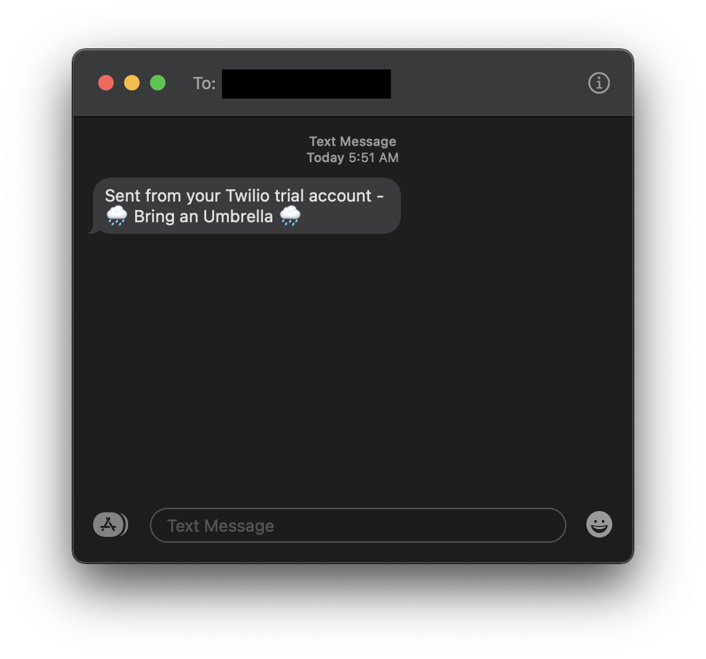

# Rain Alert
Checks to see if there is rain forcasted anytime during the next 12 hours at your location. If so, you're alerted with an SMS text to bring an umbrella.

Uses the [Twilio](https://www.twilio.com/docs/usage/api) and [Open Weather Map](https://openweathermap.org/api) APIs.

**Note**: You must set the environment variables listed in main.py with your API key information before running.

